# threadsApp-images
匿名掲示板の画像

## images

# towns システム構成図

```mermaid
flowchart LR
    subgraph Client["クライアント"]
        Browser["Webブラウザ<br/>PC / スマートフォン"]
        Pages["フロントエンド<br/>HTML / CSS / JavaScript<br/>app/home, post, search, ranking"]
        Storage["ブラウザ保存<br/>Cookie / localStorage<br/>匿名ユーザー識別、ブックマーク、テーマ"]
        Browser --> Pages
        Pages <--> Storage
    end

    Internet(("インターネット"))

    subgraph Hosting["公開環境"]
        Static["静的ファイル配信<br/>app/*.html, app/*.css, app/*.js"]
        Render["Render<br/>https://threadsappbe.onrender.com"]
    end

    subgraph Backend["バックエンド API サーバー<br/>Node.js / Express / Socket.IO"]
        Server["threadServer.js<br/>HTTPサーバー + Expressアプリ"]

        subgraph Middleware["共通ミドルウェア"]
            CORS["CORS<br/>credentials: true"]
            Cookie["cookie-parser<br/>署名付きCookie"]
            Auth["auth.js<br/>匿名ユーザー割り当て"]
            Error["errorHandler.js<br/>共通エラー応答"]
        end

        subgraph Routes["APIルート"]
            ThreadAPI["threads API<br/>一覧、作成、詳細、削除、タグ付け"]
            PostAPI["posts API<br/>コメント一覧、投稿"]
            TagAPI["tags API<br/>タグ検索、利用数"]
            RankingAPI["ranking API<br/>注目度ランキング"]
            ReactionAPI["reaction API<br/>いいね、ブックマーク"]
            DebugAPI["debug/users API"]
        end

        subgraph Services["サービス層"]
            ThreadService["threadService"]
            PostService["postService"]
            TagService["tagService"]
            RankingService["rankingService"]
            ReactionService["reactionService"]
            ScoreService["scoreCalculator"]
        end

        Realtime["リアルタイム通知<br/>Socket.IO<br/>thread:created / post:created / ranking:stale"]
        Prisma["Prisma Client<br/>ORM"]

        Server --> CORS --> Cookie --> Auth
        Auth --> Routes
        Routes --> Services
        Services --> Prisma
        Routes --> Realtime
        Error -.->|例外をJSON化| Routes
    end

    subgraph Database["データベース<br/>PostgreSQL"]
        Users[("User<br/>匿名ユーザー")]
        Threads[("Thread<br/>スレッド")]
        Posts[("Post<br/>コメント")]
        Tags[("Tag<br/>タグ")]
        Likes[("Like<br/>いいね")]
        Bookmarks[("Bookmark<br/>ブックマーク")]
    end

    Browser --> Internet
    Internet --> Static
    Pages <-->|REST API<br/>fetch + credentials| Render
    Pages <-->|WebSocket<br/>Socket.IO| Render
    Render --> Server
    Prisma --> Database

    Users --> Threads
    Users --> Posts
    Threads --> Posts
    Threads <--> Tags
    Users --> Likes
    Threads --> Likes
    Users --> Bookmarks
    Threads --> Bookmarks
```

## 構成要素

| 区分 | 内容 |
| --- | --- |
| フロントエンド | `app/home`, `app/post`, `app/search`, `app/ranking` の静的HTML/CSS/JavaScript |
| APIサーバー | `BE/threadServer.js` を起点にした Node.js / Express アプリ |
| リアルタイム通信 | Socket.IOで新規スレッド、コメント投稿、ランキング更新通知を配信 |
| データアクセス | Prisma Client経由でPostgreSQLに接続 |
| データベース | `User`, `Thread`, `Post`, `Tag`, `Like`, `Bookmark` を管理 |
| 認証・識別 | ログインではなく、署名付きCookieで匿名ユーザーを識別 |
| ブラウザ側保存 | `localStorage` にブックマーク、コメントのローカルいいね、テーマ設定を保存 |

## データの流れ

1. ユーザーがブラウザで各画面を開く。
2. フロントエンドが `https://threadsappbe.onrender.com` にREST APIリクエストを送る。
3. Expressのルートが入力値とCookieを処理し、サービス層へ渡す。
4. サービス層がPrisma Clientを使ってPostgreSQLを読み書きする。
5. APIレスポンスをフロントエンドへ返し、必要に応じてSocket.IOで他画面へ更新通知を送る。

## 主なAPI

| API | 役割 |
| --- | --- |
| `/threads` | スレッド一覧、作成、詳細取得、削除 |
| `/threads/:threadId/posts` | コメント一覧、コメント投稿 |
| `/tags` | タグ検索 |
| `/tags/count` | 利用数の多いタグ取得 |
| `/ranking/threads` | スレッドランキング取得 |
| `/threads/:threadId/reaction` | いいね、ブックマーク操作 |

## セキュリティ・運用上のポイント

- CORSはCookie付きリクエストを許可するため `credentials: true` を使う。
- Cookieは `COOKIE_SECRET` による署名付きで匿名ユーザー識別に使う。
- DB接続情報は `DATABASE_URL` と `DIRECT_URL` で環境変数管理する。
- HTMLに出力する文字列はフロントエンド側でエスケープし、XSSを抑制する。
- APIの例外は共通エラーハンドラでJSONレスポンスに統一する。
