# threadsApp-images
匿名掲示板の画像

## images

# towns システム構成図

```mermaid
flowchart LR
    subgraph Client["クライアント"]
        Browser["Webブラウザ<br/>PC / スマートフォン"]
        Pages["フロントエンド<br/>HTML / CSS / JavaScript<br/>app/home, post, search, ranking"]
        Storage["ブラウザ保存<br/>Cookie / localStorage<br/>匿名ユーザー識別、ブックマーク、テーマ"]
        Browser --> Pages
        Pages <--> Storage
    end

    Internet(("インターネット"))

    subgraph Hosting["公開環境"]
        Static["静的ファイル配信<br/>app/*.html, app/*.css, app/*.js"]
        Render["Render<br/>https://threadsappbe.onrender.com"]
    end

    subgraph Backend["バックエンド API サーバー<br/>Node.js / Express / Socket.IO"]
        Server["threadServer.js<br/>HTTPサーバー + Expressアプリ"]

        subgraph Middleware["共通ミドルウェア"]
            CORS["CORS<br/>credentials: true"]
            Cookie["cookie-parser<br/>署名付きCookie"]
            Auth["auth.js<br/>匿名ユーザー割り当て"]
            Error["errorHandler.js<br/>共通エラー応答"]
        end

        subgraph Routes["APIルート"]
            ThreadAPI["threads API<br/>一覧、作成、詳細、削除、タグ付け"]
            PostAPI["posts API<br/>コメント一覧、投稿"]
            TagAPI["tags API<br/>タグ検索、利用数"]
            RankingAPI["ranking API<br/>注目度ランキング"]
            ReactionAPI["reaction API<br/>いいね、ブックマーク"]
            DebugAPI["debug/users API"]
        end

        subgraph Services["サービス層"]
            ThreadService["threadService"]
            PostService["postService"]
            TagService["tagService"]
            RankingService["rankingService"]
            ReactionService["reactionService"]
            ScoreService["scoreCalculator"]
        end

        Realtime["リアルタイム通知<br/>Socket.IO<br/>thread:created / post:created / ranking:stale"]
        Prisma["Prisma Client<br/>ORM"]

        Server --> CORS --> Cookie --> Auth
        Auth --> Routes
        Routes --> Services
        Services --> Prisma
        Routes --> Realtime
        Error -.->|例外をJSON化| Routes
    end

    subgraph Database["データベース<br/>PostgreSQL"]
        Users[("User<br/>匿名ユーザー")]
        Threads[("Thread<br/>スレッド")]
        Posts[("Post<br/>コメント")]
        Tags[("Tag<br/>タグ")]
        Likes[("Like<br/>いいね")]
        Bookmarks[("Bookmark<br/>ブックマーク")]
    end

    Browser --> Internet
    Internet --> Static
    Pages <-->|REST API<br/>fetch + credentials| Render
    Pages <-->|WebSocket<br/>Socket.IO| Render
    Render --> Server
    Prisma --> Database

    Users --> Threads
    Users --> Posts
    Threads --> Posts
    Threads <--> Tags
    Users --> Likes
    Threads --> Likes
    Users --> Bookmarks
    Threads --> Bookmarks
```



## 構成要素

| 区分 | 内容 |
| --- | --- |
| フロントエンド | `app/home`, `app/post`, `app/search`, `app/ranking` の静的HTML/CSS/JavaScript |
| APIサーバー | `BE/threadServer.js` を起点にした Node.js / Express アプリ |
| リアルタイム通信 | Socket.IOで新規スレッド、コメント投稿、ランキング更新通知を配信 |
| データアクセス | Prisma Client経由でPostgreSQLに接続 |
| データベース | `User`, `Thread`, `Post`, `Tag`, `Like`, `Bookmark` を管理 |
| 認証・識別 | ログインではなく、署名付きCookieで匿名ユーザーを識別 |
| ブラウザ側保存 | `localStorage` にブックマーク、コメントのローカルいいね、テーマ設定を保存 |

## データの流れ

1. ユーザーがブラウザで各画面を開く。
2. フロントエンドが `https://threadsappbe.onrender.com` にREST APIリクエストを送る。
3. Expressのルートが入力値とCookieを処理し、サービス層へ渡す。
4. サービス層がPrisma Clientを使ってPostgreSQLを読み書きする。
5. APIレスポンスをフロントエンドへ返し、必要に応じてSocket.IOで他画面へ更新通知を送る。

## 主なAPI

| API | 役割 |
| --- | --- |
| `/threads` | スレッド一覧、作成、詳細取得、削除 |
| `/threads/:threadId/posts` | コメント一覧、コメント投稿 |
| `/tags` | タグ検索 |
| `/tags/count` | 利用数の多いタグ取得 |
| `/ranking/threads` | スレッドランキング取得 |
| `/threads/:threadId/reaction` | いいね、ブックマーク操作 |

## セキュリティ・運用上のポイント

- CORSはCookie付きリクエストを許可するため `credentials: true` を使う。
- Cookieは `COOKIE_SECRET` による署名付きで匿名ユーザー識別に使う。
- DB接続情報は `DATABASE_URL` と `DIRECT_URL` で環境変数管理する。
- HTMLに出力する文字列はフロントエンド側でエスケープし、XSSを抑制する。
- APIの例外は共通エラーハンドラでJSONレスポンスに統一する。


# II. グループ成果（スライド案・全4ページ）

> 氏名欄は提出者の氏名に置き換える。各ページの右下に「グループ9」を入れる。

---

## 1. 制作したシステムと目標

### 匿名Web掲示板「towns」

**誰でも、登録なしで、話題を気軽に共有できる掲示板**を制作した。若者を主な対象とし、LINEのオープンチャットの参加しやすさと、一般的な掲示板の話題別の見やすさを両立させることを目標とした。

- 利用者はユーザー登録をせずに、スレッドの閲覧・作成・投稿ができる。
- タイトル・タグによる検索、人気タグの表示、ブックマークにより、興味のある話題を探しやすくした。
- 閲覧数・いいね・投稿数・経過時間から算出する「急上昇ランキング」を実装し、現在盛り上がっている話題を見つけられるようにした。

**画面に入れるもの：** ホーム画面のスクリーンショット（スレッド作成欄、タグ一覧、ランキングへの導線が見えるもの）

---

## 2. グループとして実現した機能

### 投稿から発見までを一連の流れとして実装

| 利用の流れ | 実装内容 | ねらい |
| --- | --- | --- |
| 話題を作る | タイトル・本文・最大20件のタグを指定してスレッドを作成 | 話題を整理し、後から探しやすくする |
| 会話する | スレッド詳細で投稿を追加し、新着投稿をリアルタイムに反映 | 複数人が同じ話題を追いやすくする |
| 話題を探す | キーワード検索、タグ検索、複数タグによる絞込み、人気タグ表示 | 興味のあるスレッドへ到達しやすくする |
| 保存・評価する | Cookieを利用した匿名のいいね、ブラウザ内のブックマーク | アカウント登録なしでも利用状態を保つ |
| 注目話題を知る | 総合・いいね・閲覧・急上昇のランキング、期間・タグでの絞込み | 新しい／活発な話題を発見しやすくする |

画面はホーム、スレッド詳細、検索、ランキングに分割しつつ、共通のサイドバー・カード・ページネーションを再利用して、操作方法と見た目を統一した。

**画面に入れるもの：** 「ホーム → 詳細 → 検索／ランキング」の4画面を小さく並べた画像

---

## 3. システム構成と設計上の工夫

### フロントエンドとAPIを分離し、拡張しやすくした

```text
ブラウザ（HTML / CSS / JavaScript）
       │ REST API・Socket.IO
       ▼
Express（ルーティング・認証・エラー処理）
       ▼
サービス層（スレッド／投稿／タグ／リアクション／ランキング）
       ▼
Prisma ORM  ──  PostgreSQL
```

- **匿名性：** 署名付きCookieで匿名ユーザーを識別する。これにより登録画面を設けずに、同一利用者のいいね重複を防止した。
- **データ設計：** スレッドとタグは中間テーブルを用いた多対多関係とし、1つのスレッドに複数のタグを付けられるようにした。
- **リアルタイム性：** Socket.IOで、投稿作成時は対象スレッドを閲覧中の利用者へ通知し、スレッド作成時はホームの一覧・タグを更新する。
- **保守性：** URLごとのルートと業務処理を行うサービス層を分け、ランキング計算も専用モジュールとして独立させた。

**画面に入れるもの：** 発表資料のシステム構成図またはER図

---

## 4. 自分の役割とグループ成果への貢献

### バックエンド設計・ランキング機能・統合を主に担当

私は、掲示板の基盤となるバックエンドの設計・実装と、ランキング機能の設計・統合を中心に担当した。

- **ランキング機能：** 閲覧数、いいね数、投稿数をスコア化し、作成からの経過時間で減衰させる急上昇ランキングを実装した。閲覧数には対数を用い、少数の大量閲覧で順位が極端に上がらないようにした。重みは「閲覧 0.1、いいね 0.6、投稿 0.3」とし、能動的な評価であるいいねを最も重視した。
- **匿名利用と閲覧数の信頼性：** Cookieで識別した同一利用者が同じスレッドを再読込しても、閲覧数を一度だけ計上する `ThreadView` を追加した。ランキングの入力値が実際の関心をより反映するようにした。
- **連携・統合：** Socket.IOによる更新通知、リアクションAPI、タグ・ページネーションをフロントエンドと接続し、画面間で一貫して動作するよう調整した。共通コンポーネント化とREADME・API資料の整備にも取り組んだ。
- **検証：** ホーム、検索、詳細、ランキングを対象にE2Eテストを用意し、検索条件の引継ぎ、ブックマーク、ランキング切替、API障害時の表示まで確認した。

**自己評価：** 個別機能の実装にとどまらず、データモデル、API、画面更新、テストをつなげて完成度を高める役割を果たした。

**画面に入れるもの：** ランキング画面のスクリーンショット＋右側にスコア式（下記）

`急上昇スコア = {0.1 × log(閲覧数+1) + 0.6 × いいね数 + 0.3 × 投稿数} × 時間減衰`


# III. 個人の作業報告（スライド案・第8〜11回／全4ページ）

> 各ページをスライド1枚として使用する。見出しの下に「課題 → 実施 → 結果／次回」の順で配置する。

---

## 第8回　個人課題の整理

### ランキングを中心に、匿名性・開発管理・拡張機能を課題化した

この時点ではランキング画面の見た目だけを先に作成しており、順位を決めるデータや計算方法が未確定だった。また、匿名掲示板として利用者をどのように識別するか、複数人で編集するコードをどのように管理するかも、完成度に直結する課題であった。

| 課題 | 目標 | 手段・計画 |
| --- | --- | --- |
| ランキング | 画面だけでなく、根拠のある順位を返せるようにする | 閲覧数・いいね数・投稿数・経過時間を候補として比較し、API仕様とスコア式を設計する |
| 匿名ユーザーの識別 | 登録なしでも、同一利用者の操作を区別できるようにする | Cookieに匿名IDを保存し、DBのユーザー情報と結び付ける方法を調査・実装する |
| コード管理 | ファイル増加と同時編集による混乱を抑える | GitHubでブランチを分け、機能単位でコミット・マージする運用を徹底する |
| 動画・画像投稿 | 投稿に添付できる表現を広げる | 優先度を下げ、掲示板の基本機能とデータ設計を固めた後の拡張課題とする |

**この回の判断：** まず「ランキング」「匿名利用」「コード管理」を優先し、動画像の添付は基本機能を安定させた後の未実装課題として整理した。課題を機能単位に分けたことで、次回以降にランキングAPIの実装へ着手できた。

**図として入れるもの：** 「ランキング／匿名ID／GitHub管理／添付機能」の4項目を優先度順に並べた図

---

## 第9回（6月17日）　タグ採用数ランキングの設計・実装

### タグの利用状況を数値化し、ランキング画面の入力データを整備した

ランキングを表示するためには、スレッドの内容だけでなく「どのタグがどれだけ使われているか」を取得する必要があった。そこで、タグとスレッドの多対多関係を利用し、タグごとの採用数を返すAPIを設計・実装した。

- **設計：** `GET /tags/count?num=…` を用意し、使用スレッド数の多いタグを指定件数だけ返す仕様にした。
- **実装：** Prismaでタグごとに関連スレッド数を集計し、件数の降順で並べた。フロントエンドでは、返却された上位タグをランキング画面のカテゴリやサイドバーに表示した。
- **工夫：** タグ名だけでなくタグIDと件数を返すことで、表示後に特定のタグでランキングを絞り込めるようにした。
- **結果：** タグの採用数を、利用者が話題を発見するための「人気タグ」と、ランキングを絞り込むための条件の両方に利用できる形にした。

**次回への課題：** タグの人気だけではスレッドの盛り上がりを表せないため、閲覧数を記録する仕組みと、1時間・3時間・24時間など集計期間を指定できるランキングAPIを追加する計画とした。

**図として入れるもの：** `Tag ──< Thread` の関係図、または人気タグが表示されたランキング画面

---

## 第10回（6月24日）　ランキングAPIとスコア算出方法の具体化

### 「何を上位に表示するか」をAPI仕様と計算式に落とし込んだ

第9回のタグ集計を基礎として、スレッド単位のランキングを実装した。単純な累計値だけでは古いスレッドが上位に残り続けるため、ランキング種別と集計期間をパラメータで指定し、急上昇を評価するスコアを設計した。

- **API設計：** `GET /ranking/threads` に、種別（閲覧・いいね・投稿・急上昇）、期間（1時間、3時間、24時間、週、月、累計）、タグ、ページングを指定できるようにした。不正な種別・期間・タグIDは400エラーで拒否する。
- **スコア設計：** 急上昇スコアを `｛0.1×log(閲覧数+1) + 0.6×いいね数 + 0.3×投稿数｝×時間減衰` とした。閲覧数だけで順位が偏らないように対数を用い、能動的な評価であるいいねを最も重視した。
- **時間減衰：** 作成から時間が経過するほど重みを下げることで、累計人気ではなく「現在盛り上がっている」スレッドを発見できるようにした。
- **画面実装：** 総合ランキングに加え、いいね・閲覧の上位リスト、期間切替、タグカテゴリ、読み込み中・取得失敗・0件時の表示を実装した。

**次回への課題：** 発表資料を作成するとともに、投稿時のタグ上限、タグの追加・削除を実装し、タグデータの品質を保てるようにする。

**図として入れるもの：** ランキング画面と、上記の急上昇スコア式

---

## 第11回（7月1日）　タグ制約・匿名ユーザー・リアクションの整備

### データの不整合を防ぎ、匿名利用でも操作状態を保てるようにした

ランキングの計算結果を信頼できるものにするには、入力となるタグ・ユーザー・いいねのデータを整える必要がある。そこで、タグ数の制約、匿名ユーザーの識別、いいねの追加・削除APIを実装し、発表資料の担当部分も作成した。

- **タグ付与上限：** スレッド作成時にタグを配列として受け取り、21件以上ならエラーを返す検証を実装した。上限を20件にすることで、過剰なタグ付与による検索・ランキングのノイズを抑えた。動作確認まで完了した。
- **匿名ユーザーの整備：** 初回アクセス時にUUIDを生成して署名付きCookieへ保存し、`userHash` としてDBの `User` レコードに対応付けた。ログイン画面を作らずに、同一利用者を識別できるようにした。
- **いいねAPI：** `PUT /threads/:threadId/reaction?type=like` で追加、`DELETE` で削除するエンドポイントを実装した。ユーザーIDとスレッドIDの組を一意に管理し、同じ利用者が同一スレッドへ重複していいねできないようにした。
- **連携：** いいね数はスレッド詳細・ランキングの評価指標に利用し、後続のスコア検証へつなげた。発表用スライドでは担当した設計・ランキング部分を説明できるように整理した。

**次回への課題：** 各ランキング種別・集計期間でスコアが想定どおりになるかをテストし、発表用台本を作成する。タグ追加・削除APIも完成させ、スレッドの分類を更新できるようにする。

**図として入れるもの：** 「Cookie → userHash → User → Like → Ranking」のデータ連携図


# IV. 最終的な成果（スライド案・全4ページ）

> 聞き取り内容を基に作成。各ページをスライド1枚として使用する。

---

## 1. 発生した問題点・困難だった点

### 計画・設計の不足が、開発中の変更と品質低下につながった

- **進捗のばらつき：** メンバーごとに確保できる時間や作業への熱量が異なり、進捗と作業量に差が生じた。遅れている機能が全体の完成時期に影響する状態になった。初期から担当ごとの期限・週ごとの到達目標（ノルマ）を設定し、定期的に進捗を確認する仕組みがあれば、遅れを早い段階で把握して調整できたと考える。
- **要件・設計変更：** 初期の要件定義・設計の話合いが十分でなかったため、開発中に「必要な機能」が追加され、仕様変更が繰り返し発生した。データベース設計も2回程度変更し、その都度、関連する作業の停止・調整が必要になった。
- **バックエンド構成：** 開始時はバックエンドの役割分割を十分に考えず、処理を1つのコードに集約していた。その結果、修正箇所が広がり、可読性・保守性・品質の面で問題が生じた。
- **フロントエンドとの連携：** 途中からフロントエンドの作業が加わったが、要件定義や設計資料が不足していた。開発途中で追加要望が増え、AIを用いた実装でも命名・関数・機能の統一がとれず、管理と品質が低下した。
- **認証・匿名利用：** Cookieへ意図どおりに情報を保存できない、同一利用者にIDが複数発行されるなど、匿名ユーザーを安定して識別する実装と動作確認に時間を要した。

---

## 2. 問題への対応・改善方法

### 優先順位の見直し、構造化、共通化によって完成を目指した

| 問題 | 対応・改善 |
| --- | --- |
| 進捗差・作業の遅れ | 自分の担当を終えたメンバーから遅れている作業の補助に入り、チーム全体の進捗を底上げした。今後は、担当ごとの期限・週単位の到達目標を設定し、定例で進捗を確認して早期に再配分する。 |
| 仕様の追加・変更 | 実装する機能と後回しにする機能を整理した。完成に必要な基本機能を優先し、動画像投稿などは優先度を下げた。 |
| バックエンドの保守性 | サーバ、ルート、サービス、ミドルウェアへ処理を分割した。機能ごとの責務を分け、修正時にフロントエンドや他担当へ及ぶ影響を小さくした。 |
| フロントエンドの不統一 | サイドバーやCSSなど複数画面で共通する機能を洗い出し、`shared` として独立させた。画面ごとの重複を減らし、見た目と操作を統一した。 |
| 匿名ユーザーの識別 | Cookie保存とID発行をトライアンドエラーで検証し、署名付きCookieの匿名IDを `userHash` としてDBのユーザー情報と対応付ける構成へ調整した。 |

**対応の考え方：** すべてを同時に直すのではなく、完成度に直結する「基本機能の安定」「他機能への影響を抑える構造」「画面間の統一」を優先した。

---

## 3. グループ内での自分の役割と貢献の自己評価

### 設計・実装・統合・品質確認を横断して担当した

私の担当は、特定画面や単一機能に限らず、プロジェクト全体をつなぐ役割であった。

- **企画・設計：** 企画書・要件定義書の作成、各APIの設計を担当した。データベース設計では主に相談役として、実装との整合性を確認した。
- **バックエンド：** スレッド、投稿、タグ、リアクション、ランキングなどのAPIを設計・実装し、サーバ・ルート・サービス・ミドルウェアに分割して保守しやすい構造へ改善した。
- **ランキング：** ランキング画面と機能を担当し、閲覧数・いいね数・投稿数・経過時間を使った急上昇スコアを実装した。
- **フロントエンドの統合：** CSS・JavaScriptの共通部分を独立・統一し、サイドバーなどの共通UIを複数画面で再利用できるようにした。
- **連携・品質：** 全体のコード管理、作業の補助・相談、品質確認、テスト、細かな調整を行った。進捗が遅れている部分を補助し、個別作業を最終成果物としてつなげることに貢献した。

**自己評価：** 実装量だけでなく、仕様変更や担当間の影響を調整し、完成に向けて全体を前進させる役割を担えた。一方で、初期段階から設計資料・命名規則・作業手順をより明確にできていれば、後半の調整コストをさらに減らせたと考える。

---

# V. 今後の課題・改善点（スライド案・全2ページ）

> Ⅳで整理した未解決事項を、今後の改善課題として再構成したもの。

---

## 1. 機能・品質面での今後の課題

### 基本機能を土台に、投稿表現とブックマークを完成させる

| 課題 | 現状 | 今後の改善 |
| --- | --- | --- |
| 動画像の投稿 | 発表・提出時点では未実装 | 保存先、対応形式、容量上限、投稿画面での表示方法を設計し、画像・動画を安全に添付できる機能を追加する。 |
| ブックマークの保存 | DB用テーブルはあるが、ログイン機能がないため、ブラウザのローカルストレージに保存している | 匿名IDとDBのBookmarkを連携させ、ブラウザのデータ削除や別端末でも扱える保存方法を検討する。 |
| ブックマーク一覧の不具合 | ブックマーク済みスレッドの一部しか表示されない場合がある | 保存ID、取得件数、絞込み条件を対象としたテストを追加し、再現条件の特定と修正を行う。 |
| 投稿詳細画面のUI | コメントの表示形式・入力欄がチームの理想の状態まで調整できていない | 利用者視点で画面を確認し、表示階層、余白、入力時の操作性を改善する。 |

---

## 2. 設計・運用面での今後の課題

### 仕様と開発手順を早期に固め、変更コストを減らす

- **ランキングの拡張：** 現在はブックマーク数をランキング指標に含めていない。追加する場合は、利用者にとっての価値を確認した上で重みを設計し、API・スコア計算・画面表示を一貫して実装する。
- **要件定義・設計資料：** 開発開始前に画面・API・データベースの仕様を明文化し、変更時には影響範囲を記録する。後からの機能追加による手戻りを減らす。
- **進捗管理：** 担当ごとの期限と週単位の到達目標を設定し、定例で進捗を確認する。遅れを早期に把握し、補助や担当再配分を行えるようにする。
- **実装ルール：** 変数名・関数名・ディレクトリ構成・共通コンポーネントの使い方を事前に定める。AIを用いて実装する場合も、仕様書とルールを基準にレビューし、コードの統一性を保つ。

**まとめ：** 今後は、未実装機能の追加だけでなく、設計資料・進捗管理・実装ルールを早期に整えることで、機能追加に耐えられる開発体制と品質を目指す。


